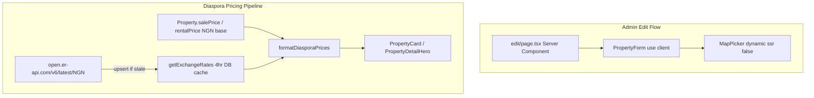

# ATU Real Estate: SSR, Currency & Dynamic Form Plan

## Current State Assessment

Substantial work is **already present in uncommitted changes**. The working tree matches the spec closely:

| Task                               | Status              | Evidence                                                                                                                                                                                                                                                                                                                                                   |
| ---------------------------------- | ------------------- | ---------------------------------------------------------------------------------------------------------------------------------------------------------------------------------------------------------------------------------------------------------------------------------------------------------------------------------------------------------- |
| Task 1 — SSR crash fix             | Done                | [`components/admin/PropertyForm.tsx`](components/admin/PropertyForm.tsx) replaced static `MapPicker` import with `next/dynamic` + `ssr: false` + skeleton loader                                                                                                                                                                                           |
| Task 2 — ExchangeRate schema       | Done                | [`prisma/schema.prisma`](prisma/schema.prisma) lines 144–149                                                                                                                                                                                                                                                                                               |
| Task 2 — Currency engine           | Done (untracked)    | [`lib/currency.ts`](lib/currency.ts) — `getExchangeRates`, `formatDiasporaPrices`, `getDiasporaDisplayPrice`                                                                                                                                                                                                                                               |
| Task 2 — API/display wiring        | Done                | [`app/api/properties/route.ts`](app/api/properties/route.ts), [`app/api/properties/[id]/route.ts`](app/api/properties/[id]/route.ts), [`lib/properties.ts`](lib/properties.ts), [`components/property/PropertyCard.tsx`](components/property/PropertyCard.tsx), [`components/property/PropertyDetailHero.tsx`](components/property/PropertyDetailHero.tsx) |
| Task 3 — Conditional form map      | Done                | `CONDITIONAL_PROPERTY_FIELDS` + dynamic render block in [`PropertyForm.tsx`](components/admin/PropertyForm.tsx)                                                                                                                                                                                                                                            |
| Task 3 — Submit-time field hygiene | Done                | `onSubmit` nullifies inactive conditional fields before PATCH/POST                                                                                                                                                                                                                                                                                         |
| Task 4 — Validation                | Not yet run         | Requires DB push + dev server smoke test                                                                                                                                                                                                                                                                                                                   |
| Task 5 — DB bootstrap              | **Blocked**         | Runtime error: `public.Property` table does not exist — full schema not applied to PostgreSQL                                                                                                                                                                                                                                                              |
| Task 6 — Property card View CTAs   | **Missing/partial** | Home page [`ui/PropertyCard`](components/ui/PropertyCard.tsx) has WhatsApp only; properties page card needs consistent prominent View CTA                                                                                                                                                                                                                  |



---

## Task 1: SSR Crash — Verify & Harden (Minimal)

**Root cause (confirmed):** Static import of [`MapPicker.tsx`](components/admin/MapPicker.tsx) pulled `react-leaflet` / `leaflet` into server module evaluation, triggering `ReferenceError: window is not defined`.

**Fix already applied** in `PropertyForm.tsx`:

```28:38:components/admin/PropertyForm.tsx
const MapPicker = dynamic(
  () => import("./MapPicker").then((mod) => mod.MapPicker),
  {
    ssr: false,
    loading: () => (
      <div className="h-[300px] w-full animate-pulse bg-slate-900 rounded-xl flex items-center justify-center text-slate-500 text-sm border border-slate-800">
        Initializing Interactive Map Engine...
      </div>
    )
  }
);
```

**Remaining action:** Smoke-test `/admin/dashboard/properties/[id]/edit` after dev start. No further code change expected unless the crash persists (unlikely).

**Note:** [`PropertyMap.tsx`](components/property/PropertyMap.tsx) on the public detail page is already `"use client"` and imported from a server page — this is safe and does not need the same fix.

---

## Task 2: Multi-Currency Engine — Sync DB & Confirm Integration

### 2.1 Schema (done)

`ExchangeRate` model is defined in [`prisma/schema.prisma`](prisma/schema.prisma):

```144:149:prisma/schema.prisma
model ExchangeRate {
  id          String   @id @default(cuid())
  currency    String   @unique
  rateToNaira Float
  updatedAt   DateTime @updatedAt
}
```

### 2.2 Currency utility (done)

[`lib/currency.ts`](lib/currency.ts) implements:

- 4-hour TTL cache via `prisma.exchangeRate.findMany()` freshness check
- Fetch from `https://open.er-api.com/v6/latest/NGN`, reciprocal conversion (`rateToNaira = 1 / apiRate`)
- Upsert for USD, GBP, EUR, AED
- Graceful fallback to stale DB rows or hardcoded defaults on API failure

### 2.3 Formatter pipeline (done)

`formatDiasporaPrices` outputs chains like `₦150,000,000 | $100,000 | £78,000 | €92,000 | د.إ367,000`.

`getDiasporaDisplayPrice` selects `salePrice || rentalPrice`, appends rental frequency suffixes when applicable.

### Required remaining steps

1. **Apply full schema to PostgreSQL** (no migrations folder exists; project uses `prisma db push`):
   ```bash
   pnpm prisma:generate && pnpm prisma:push && pnpm prisma:seed
   ```
   This creates **all** models — `Property`, `PropertyMedia`, `ExchangeRate`, `User`, `Inquiry` — not just `ExchangeRate`.
2. **Ensure `lib/currency.ts` is tracked** — it is currently untracked (`?? lib/currency.ts`).
3. **First-request warm-up:** Visiting any property list/detail page or hitting `GET /api/properties` will populate `ExchangeRate` rows automatically.

---

## Task 5: Fix Missing Database Tables (`Property` does not exist)

### Error profile

```text
Invalid `prisma.property.findMany()` invocation:
The table `public.Property` does not exist in the current database.
```

This is a **schema drift** issue: [`prisma/schema.prisma`](prisma/schema.prisma) defines models locally, but the connected PostgreSQL database has never received a `db push` (or migration). Every Prisma query — admin dashboard, `GET /api/properties`, currency cache — will fail until tables exist.

### Fix steps

1. Confirm `DATABASE_URL` in [`.env.production`](.env.production) points to the intended Neon/PostgreSQL instance (use this file for all Prisma bootstrap commands, not `.env`):
   ```bash
   cd /home/devmyke/Documents/GitHub/atu-real-estate
   export DATABASE_URL="$(grep '^DATABASE_URL=' .env.production | cut -d'=' -f2- | tr -d '\"')"
   pnpm prisma:generate
   pnpm prisma:push
   pnpm prisma:seed
   ```

### Notes

- No code change required for this error — it is purely operational.
- If `prisma db push` fails (permissions, wrong DB), surface the connection error and fix `DATABASE_URL` before continuing.
- Seed creates slugs like `lekki-luxury-sale-duplex` — distinct from static homepage metadata slugs (`3-bedroom-duplex-lekki`). Homepage cards link to metadata slugs; live `/properties` page uses API/seed slugs. See Task 6 note below.

### Out-of-scope (not in spec, skip unless requested)

- Updating `buildPropertyDescription` in [`lib/properties.ts`](lib/properties.ts) to use diaspora formatting for OG tags (currently NGN-only shorthand).
- Homepage [`PropertiesSection`](components/sections/Properties.tsx) still uses static metadata, not live API — separate from this spec.

---

## Task 3: Dynamic Admin Form — One UX Gap to Close

### Done

- `FormFieldDefinition` type and `CONDITIONAL_PROPERTY_FIELDS` map for all four `ListingType` values
- Shared fields (title, slug, description, listing type, status, city/state/country, MapPicker) remain structurally above the dynamic block
- Dynamic grid renders beneath listing type selector with Tailwind admin styling
- Submit handler nullifies all inactive conditional fields:

```179:204:components/admin/PropertyForm.tsx
const allConditionalFields = [
  "salePrice", "bedrooms", "bathrooms", "toilets", "sizeSqm",
  "rentalPrice", "priceFrequency", "availableFrom", "leaseTerm",
  "serviceCharge", "cautionFee", "landSizeSqm", "titleType"
];
// ... activeFields vs allConditionalFields → null inactive on submit
```

### Gap: listing-type switch should reset stale DOM inputs immediately

The spec requires clearing unrelated inputs **when listing type changes**, not only on submit. Conditional inputs use `defaultValue`, and several field names are reused across types (`salePrice`, `leaseTerm`, `titleType`, `landSizeSqm`, `bedrooms`). Without a remount, React may preserve typed values when switching types.

**Fix (small, targeted):** Add `key={listingType}` to the dynamic fields container so inputs remount cleanly on type change:

```tsx
<div key={listingType} className="grid grid-cols-1 gap-4 md:grid-cols-2 border-t ...">
```

For edit mode, optionally filter `defaultValue` so a field only pre-fills from `property` when it belongs to the **saved** listing type (prevents showing SALE bedrooms when admin previews RENTAL fields before save). This is a nice-to-have; `key` + submit nullification satisfies the spec's database hygiene rule.

### Optional refactor (not required)

Extract `CONDITIONAL_PROPERTY_FIELDS` to e.g. [`components/admin/property-field-config.ts`](components/admin/property-field-config.ts) if `PropertyForm.tsx` feels too large — spec allows either location.

---

## Task 6: Property Card "View Property" CTAs (Landing Site)

Two different card components are in use:

| Page                       | Component                                                                      | Current CTA                                                                                                                     |
| -------------------------- | ------------------------------------------------------------------------------ | ------------------------------------------------------------------------------------------------------------------------------- |
| Home (`/`)                 | [`components/ui/PropertyCard.tsx`](components/ui/PropertyCard.tsx)             | WhatsApp "Enquire Now" only — **no View Property link**                                                                         |
| Properties (`/properties`) | [`components/property/PropertyCard.tsx`](components/property/PropertyCard.tsx) | Has a "View Property" `Link`, but it is a small inline button with no companion actions — user reports it as missing/inadequate |

### Home page fix — [`components/ui/PropertyCard.tsx`](components/ui/PropertyCard.tsx)

Add a primary **View Property** link above or beside the existing WhatsApp button:

```tsx
import Link from "next/link";

<Link
  href={`/properties/${property.slug}`}
  className="inline-flex w-full items-center justify-center rounded-md bg-accent px-4 py-2.5 text-sm font-semibold text-white hover:bg-accent-light transition"
>
  View Property
</Link>
<WhatsAppButton ... label="Enquire Now" className="w-full" />
```

Layout: stack both CTAs in a `flex flex-col gap-2` row at the card footer so View Property is the primary action and Enquire is secondary.

Optional UX polish: wrap the image + title in a `Link` to the same slug so the whole card header is clickable.

### Properties page fix — [`components/property/PropertyCard.tsx`](components/property/PropertyCard.tsx)

Enhance the existing View CTA to match home page styling:

- Make the button **full-width** (`w-full justify-center`) for visual parity
- Add a secondary WhatsApp/enquire action (reuse [`WhatsAppButton`](components/ui/WhatsAppButton.tsx) or a plain link using site contact number from [`metadata/site.ts`](metadata/site.ts))
- Stack CTAs in the same `flex flex-col gap-2` pattern

### Slug alignment note (homepage static data)

Homepage [`PropertiesSection`](components/sections/Properties.tsx) reads from static [`metadata/properties.ts`](metadata/properties.ts), whose slugs (`3-bedroom-duplex-lekki`, etc.) differ from seed DB slugs (`lekki-luxury-sale-duplex`, etc.). View Property links on the homepage will 404 until either:

- **(A)** Static metadata slugs are updated to match seeded properties, or
- **(B)** Homepage is wired to `GET /api/properties?featured=true` (recommended long-term, out of minimal scope)

For this task, implement the CTA links using `property.slug` as-is; optionally align static metadata slugs to seed data as a quick follow-up so homepage links resolve.

---

## Task 4: Baseline Validation Checklist

Run sequentially after DB bootstrap:

1. `pnpm prisma:generate && pnpm prisma:push && pnpm prisma:seed`
2. `pnpm dev` — confirm Turbopack compiles with zero `window is not defined` errors
3. `GET /api/properties` returns property list (no `Property does not exist` error)
4. Visit `/admin/dashboard/properties/[id]/edit`:
   - Page returns 200 (no HTTP 500)
   - Map skeleton appears, then interactive map loads client-side
   - Switching listing type shows correct conditional fields
   - Saving with a type switch nullifies prior-type-only DB columns
5. Visit `/properties` and a detail page:
   - Each card shows **View Property** CTA (full-width, navigates to `/properties/[slug]`)
   - Prices show diaspora chain (`property.diasporaPrice`) with NGN fallback via `getDisplayPrice`
6. Visit homepage featured section — each card shows **View Property** + Enquire CTAs
7. Confirm `ExchangeRate` table populated after first property API call

---

## Files Touched (summary)

| File                                                                                       | Action                                                                |
| ------------------------------------------------------------------------------------------ | --------------------------------------------------------------------- |
| [`components/admin/PropertyForm.tsx`](components/admin/PropertyForm.tsx)                   | Already updated; add `key={listingType}` on dynamic block             |
| [`lib/currency.ts`](lib/currency.ts)                                                       | Already complete; ensure committed                                    |
| [`prisma/schema.prisma`](prisma/schema.prisma)                                             | Already updated; push to DB                                           |
| [`app/api/properties/route.ts`](app/api/properties/route.ts)                               | Already wired                                                         |
| [`app/api/properties/[id]/route.ts`](app/api/properties/[id]/route.ts)                     | Already wired                                                         |
| [`lib/properties.ts`](lib/properties.ts)                                                   | Already wired                                                         |
| [`types/index.ts`](types/index.ts)                                                         | Already has `diasporaPrice?: string`                                  |
| [`components/property/PropertyCard.tsx`](components/property/PropertyCard.tsx)             | Enhance View Property CTA + add Enquire; already uses diaspora price  |
| [`components/ui/PropertyCard.tsx`](components/ui/PropertyCard.tsx)                         | **Add** View Property link (home page featured section)               |
| [`components/property/PropertyDetailHero.tsx`](components/property/PropertyDetailHero.tsx) | Already uses diaspora price                                           |
| [`metadata/properties.ts`](metadata/properties.ts)                                         | Optional: align static slugs with seed data so homepage links resolve |

**No changes needed:** [`MapPicker.tsx`](components/admin/MapPicker.tsx), [`app/admin/dashboard/properties/[id]/edit/page.tsx`](app/admin/dashboard/properties/[id]/edit/page.tsx)
